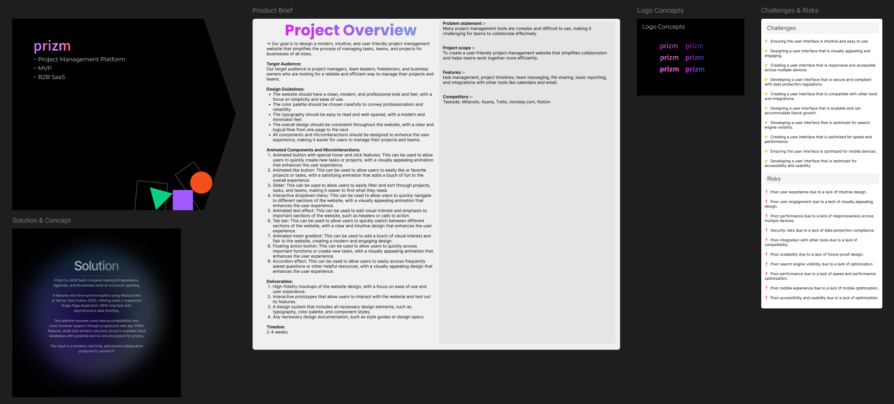
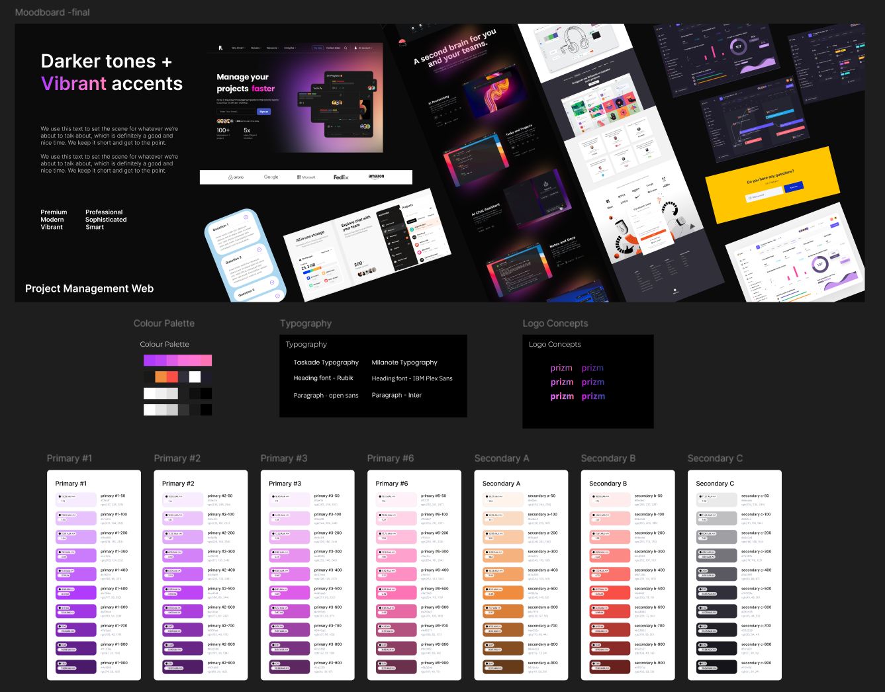
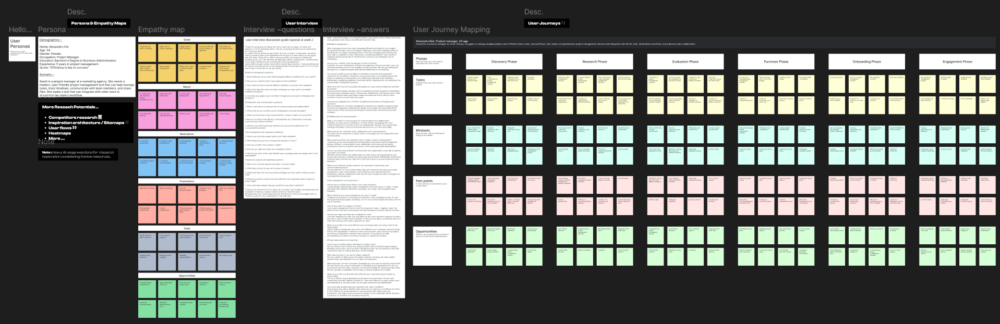
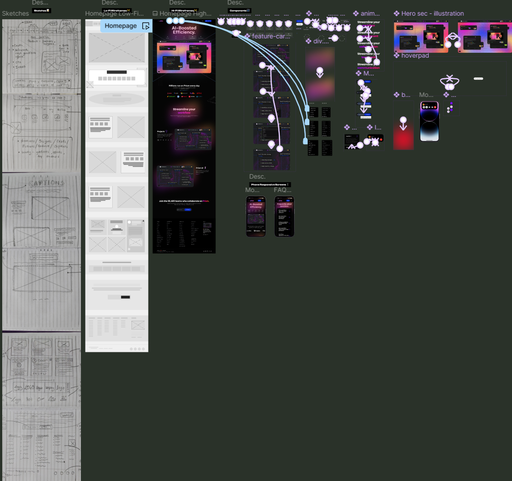

# **Prizm - Project Management Platform**

### **Description**  
At the age of 15, I built an entire MVP for **Prizm**—a B2B SaaS Project Management Platform—from scratch. This startup-level MVP includes everything from A to Z:  
- A responsive landing page
- Mobile screens and dashboards  
- Research exploration  
- Visual branding  
- UI/UX concepts, DevEx/DevRel, workflows, wireframes, prototypes, and interactions  
- Complete project documentation  

Explore the live resources:  
- [Live Figma File (Demo)](https://figma.com/design/B1zfviG8CBnRPFKMC1RwW4/Prizm---Project-Management-Platform-v1.0?node-id=1-15&amp;t=csdfIyqkUW9K0Lfa-1)  
- [Twitter Thread with Full Breakdown](https://x.com/rahul_lash37185/status/1843861494674665922)  

**Here’s how it all came together 👇**

---

## **Table of Contents**  
1. [Project Overview](#01-project-overview)  
2. [Visual Exploration](#02-visual-exploration)  
3. [Research Exploration](#03-research-exploration)  
4. [Final Designs](#04-final-designs)  
5. [Live Demo & Resources](#05-live-demo-and-resources)  

---

## **01. Project Overview**  
I began by defining the core concept of Prizm, starting with:  
- A detailed project brief  
- Logo design and branding  
- How Prizm works?  
- Key challenges and risks identification  
- Mapping the roadmap to deliver a scalable platform  

Prizm was born from this foundational vision!  

>   

---

## **02. Visual Exploration**  
Crafting the visual identity was a key step:  
- Started with an **Inspiration Board** to shape the design direction.  
- Developed **moodboards**, **logo concepts**, **color palettes**, **typography**, and **style guides**.  
- Brought creativity to life while keeping user accessibility in mind.  

>   

---

## **03. Research Exploration**  
Research was at the heart of this project. I conducted:  
- **Persona & Empathy Mapping** to empathize with end-users.  
- **User Interviews** to uncover pain points and goals.  
- **User Journey Mapping** to refine the workflow and deliver optimal solutions.  

These insights directly influenced the platform’s design.  

>   

---

## **04. Final Designs**  
This is where it all came together! The final designs include:  
- Sketches to **low-fidelity wireframes** for quick iteration.  
- High-fidelity wireframes and fully responsive mobile screens.  
- Polished components for consistent UI/UX design.  

>   

---

## **05. Live Demo and Resources**  
Check out the live resources for an in-depth look:  
- [Live Figma File (Demo)](https://figma.com/design/B1zfviG8CBnRPFKMC1RwW4/Prizm---Project-Management-Platform-v1.0?node-id=1-15&amp;t=csdfIyqkUW9K0Lfa-1)  
- [Twitter Thread with Full Breakdown](https://x.com/rahul_lash37185/status/1843861494674665922)  

---

## **License**  
This project is licensed under [Creative Commons Attribution-NonCommercial-NoDerivatives 4.0 International License](LICENSE).  

---

### **Final Thoughts**  
Building Prizm was a transformative journey of creativity, learning, and execution. I hope this documentation offers insight into the vision and effort behind the platform.  
Feel free to connect for feedback or discussions! 😊
